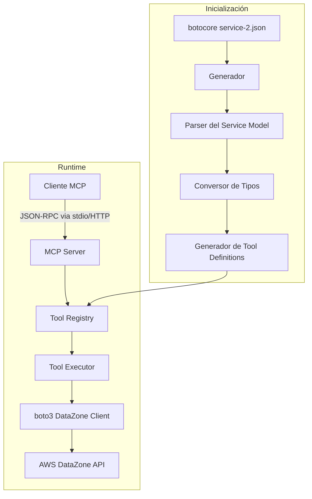
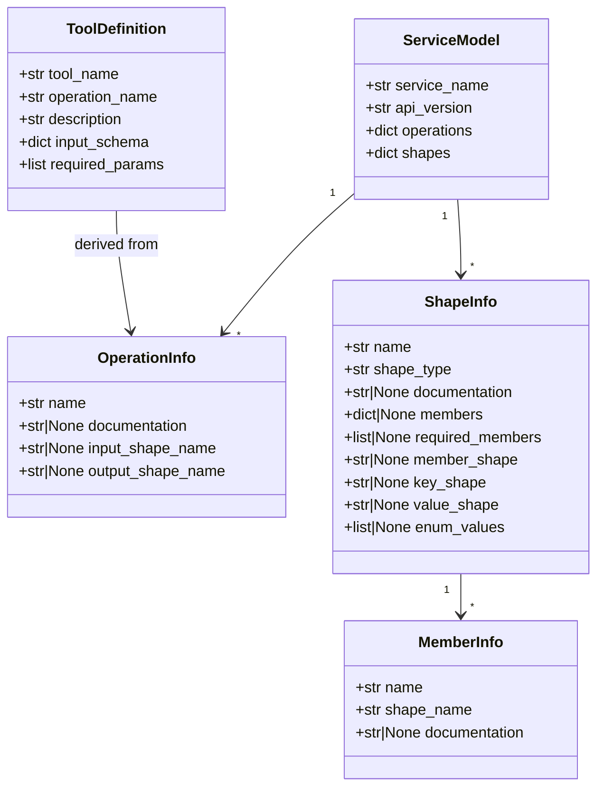
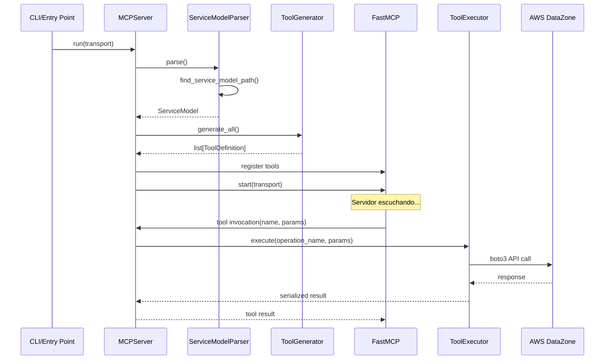

# Documento de Diseño: SageMaker Catalog MCP Server

## Visión General

El SageMaker Catalog MCP Server es un servidor MCP que auto-genera tools para las 176 operaciones de la API de DataZone (usada por SageMaker Catalog) leyendo el service model de botocore en tiempo de inicialización. Esto elimina la necesidad de escribir tools manualmente y garantiza cobertura completa y auto-actualización con nuevas versiones de boto3.

El flujo principal es:
1. Al iniciar, el Generador lee `service-2.json` de botocore
2. Parsea operaciones, shapes, y documentación
3. Genera definiciones de tools MCP con esquemas JSON Schema
4. Registra todas las tools en el servidor MCP
5. Cada invocación de tool ejecuta la operación correspondiente via boto3

## Arquitectura



### Decisiones de Diseño

1. **Generación en tiempo de inicialización vs build-time**: Se genera en tiempo de inicialización para que actualizar boto3 sea suficiente para obtener nuevas operaciones. No se necesita un paso de build separado.

2. **FastMCP como framework**: Se usa FastMCP (del paquete `mcp`) por su API declarativa simple y soporte nativo de stdio y HTTP. Permite registrar tools dinámicamente.

3. **Un solo cliente boto3**: Se reutiliza una instancia del cliente DataZone de boto3 para todas las operaciones, aprovechando connection pooling y configuración de credenciales centralizada.

4. **Representación intermedia**: El Generador produce una lista de `ToolDefinition` (dataclass) como representación intermedia entre el service model y el registro MCP. Esto facilita testing y desacopla el parseo del registro.

## Componentes e Interfaces

### 1. ServiceModelParser

Responsable de leer y parsear el archivo `service-2.json` de botocore.

```python
@dataclass
class ShapeInfo:
    name: str
    shape_type: str  # "structure", "string", "integer", "boolean", "list", "map", "timestamp", "blob", "long", "float", "double"
    documentation: str | None
    members: dict[str, "MemberInfo"] | None  # Solo para structure
    required_members: list[str] | None  # Solo para structure
    member_shape: str | None  # Solo para list (nombre del shape del elemento)
    key_shape: str | None  # Solo para map
    value_shape: str | None  # Solo para map
    enum_values: list[str] | None  # Solo para string con enum

@dataclass
class MemberInfo:
    name: str
    shape_name: str
    documentation: str | None

@dataclass
class OperationInfo:
    name: str  # PascalCase, ej: "ListDomains"
    documentation: str | None
    input_shape_name: str | None
    output_shape_name: str | None

@dataclass
class ServiceModel:
    operations: dict[str, OperationInfo]
    shapes: dict[str, ShapeInfo]
    service_name: str
    api_version: str

class ServiceModelParser:
    def parse(self, service_model_path: str | None = None) -> ServiceModel:
        """Lee y parsea el service-2.json. Si no se da path, lo busca en botocore."""
        ...
    
    def find_service_model_path(self) -> str:
        """Localiza el service-2.json de DataZone en el paquete botocore instalado."""
        ...
```

### 2. NameConverter

Convierte nombres entre PascalCase (API) y snake_case (tools MCP).

```python
class NameConverter:
    @staticmethod
    def to_snake_case(pascal_name: str) -> str:
        """Convierte PascalCase a snake_case. Ej: ListDomains → list_domains"""
        ...
    
    @staticmethod
    def to_pascal_case(snake_name: str) -> str:
        """Convierte snake_case a PascalCase. Ej: list_domains → ListDomains"""
        ...
```

### 3. TypeConverter

Convierte tipos de botocore a JSON Schema.

```python
class TypeConverter:
    def __init__(self, shapes: dict[str, ShapeInfo]):
        self.shapes = shapes
        self._resolving: set[str] = set()  # Para detectar ciclos
    
    def to_json_schema(self, shape_name: str) -> dict:
        """Convierte un shape de botocore a JSON Schema, resolviendo recursivamente."""
        ...
    
    def _convert_primitive(self, shape: ShapeInfo) -> dict:
        """Convierte tipos primitivos: string, integer, boolean, etc."""
        ...
    
    def _convert_structure(self, shape: ShapeInfo) -> dict:
        """Convierte structure a JSON Schema object con properties."""
        ...
    
    def _convert_list(self, shape: ShapeInfo) -> dict:
        """Convierte list a JSON Schema array."""
        ...
    
    def _convert_map(self, shape: ShapeInfo) -> dict:
        """Convierte map a JSON Schema object con additionalProperties."""
        ...
```

Mapeo de tipos botocore → JSON Schema:

| Tipo botocore | JSON Schema |
|---|---|
| string | `{"type": "string"}` |
| string (con enum) | `{"type": "string", "enum": [...]}` |
| integer, long | `{"type": "integer"}` |
| float, double | `{"type": "number"}` |
| boolean | `{"type": "boolean"}` |
| timestamp | `{"type": "string", "format": "date-time"}` |
| blob | `{"type": "string", "format": "base64"}` |
| list | `{"type": "array", "items": {...}}` |
| map | `{"type": "object", "additionalProperties": {...}}` |
| structure | `{"type": "object", "properties": {...}, "required": [...]}` |

### 4. ToolGenerator

Genera definiciones de tools MCP a partir del ServiceModel.

```python
@dataclass
class ToolDefinition:
    tool_name: str  # snake_case
    operation_name: str  # PascalCase original
    description: str
    input_schema: dict  # JSON Schema
    required_params: list[str]

class ToolGenerator:
    def __init__(self, service_model: ServiceModel):
        self.service_model = service_model
        self.name_converter = NameConverter()
        self.type_converter = TypeConverter(service_model.shapes)
    
    def generate_all(self) -> list[ToolDefinition]:
        """Genera una ToolDefinition por cada operación del ServiceModel."""
        ...
    
    def generate_tool(self, operation: OperationInfo) -> ToolDefinition:
        """Genera una ToolDefinition para una operación específica."""
        ...
```

### 5. ToolExecutor

Ejecuta operaciones contra AWS usando boto3.

```python
class ToolExecutor:
    def __init__(self, region: str | None = None, profile: str | None = None):
        self.client = self._create_client(region, profile)
    
    def execute(self, operation_name: str, parameters: dict) -> dict:
        """Ejecuta una operación de DataZone y retorna el resultado."""
        ...
    
    def _create_client(self, region: str | None, profile: str | None):
        """Crea el cliente boto3 de DataZone con la configuración dada."""
        ...
    
    def _serialize_response(self, response: dict) -> dict:
        """Serializa la respuesta de boto3 (maneja datetime, bytes, etc.)."""
        ...
```

### 6. MCPServer (server.py)

Punto de entrada principal que orquesta todo.

```python
class SageMakerCatalogMCPServer:
    def __init__(self):
        self.mcp = FastMCP("sagemaker-catalog-mcp-server")
        self.executor: ToolExecutor | None = None
        self.tool_definitions: list[ToolDefinition] = []
    
    def initialize(self):
        """Parsea service model, genera tools, y las registra en FastMCP."""
        ...
    
    def _register_tool(self, tool_def: ToolDefinition):
        """Registra una tool individual en FastMCP."""
        ...
    
    def run(self, transport: str = "stdio"):
        """Inicia el servidor con el transporte especificado."""
        ...
```

## Modelos de Datos

### ServiceModel (representación intermedia del parseo)



### Flujo de datos



## Propiedades de Correctitud

*Una propiedad es una característica o comportamiento que debe mantenerse verdadero en todas las ejecuciones válidas de un sistema — esencialmente, una declaración formal sobre lo que el sistema debe hacer. Las propiedades sirven como puente entre especificaciones legibles por humanos y garantías de correctitud verificables por máquinas.*

### Property 1: Round-trip del parseo del Service Model

*Para cualquier* Service Model JSON válido de botocore, parsearlo a la representación intermedia `ServiceModel` y luego serializarlo de vuelta a JSON debe producir un resultado equivalente al original (mismas operaciones, shapes, y metadatos).

**Validates: Requirements 1.6**

### Property 2: Round-trip de conversión de nombres PascalCase ↔ snake_case

*Para cualquier* nombre de operación PascalCase válido (compuesto de palabras capitalizadas, ej: `ListDomains`, `CreateAssetType`), convertirlo a snake_case y luego revertirlo a PascalCase debe producir el nombre original.

**Validates: Requirements 10.3, 10.1, 2.2**

### Property 3: Conteo y unicidad de tools generadas

*Para cualquier* Service Model con N operaciones únicas, el Generador debe producir exactamente N ToolDefinitions, y todos los nombres de tools generados deben ser únicos (sin omisiones ni duplicados).

**Validates: Requirements 2.1, 2.6, 10.2, 12.1**

### Property 4: Completitud de extracción de miembros de shapes structure

*Para cualquier* Shape de tipo `structure` en el Service Model que tiene M miembros, el parser debe extraer exactamente M miembros, cada uno con su nombre, tipo de shape referenciado, y la lista de campos requeridos debe coincidir con la del JSON original.

**Validates: Requirements 1.3**

### Property 5: Resolución recursiva de shapes anidados

*Para cualquier* Shape de tipo `list` o `map` en el Service Model, la resolución recursiva de tipos internos debe terminar (no entrar en ciclo infinito) y producir un JSON Schema válido con la estructura correcta (`array` para list, `object` con `additionalProperties` para map).

**Validates: Requirements 1.4**

### Property 6: Fidelidad de tool definitions respecto al Service Model

*Para cualquier* operación en el Service Model que tiene documentación y un input shape, la ToolDefinition generada debe contener: (a) una descripción derivada de la documentación de la operación, y (b) un input_schema cuyas propiedades requeridas coinciden con los campos marcados como required en el input shape.

**Validates: Requirements 2.3, 2.4**

### Property 7: Conversión de tipos botocore a JSON Schema

*Para cualquier* tipo primitivo de botocore (string, integer, long, float, double, boolean, timestamp, blob), la conversión a JSON Schema debe producir el tipo JSON Schema correcto según el mapeo definido. Para strings con enum, el schema debe incluir la lista de valores permitidos.

**Validates: Requirements 2.5**

### Property 8: Serialización de respuestas boto3 a JSON

*Para cualquier* respuesta de boto3 que contenga tipos no-JSON-nativos (datetime, bytes, Decimal), la serialización debe producir un string JSON válido que pueda ser parseado de vuelta sin errores.

**Validates: Requirements 4.2**

### Property 9: Validación de parámetros rechaza entradas inválidas

*Para cualquier* Tool con campos requeridos en su esquema, invocarla con un diccionario de parámetros que omite al menos un campo requerido debe resultar en un error de validación (no en una llamada a la API de AWS).

**Validates: Requirements 4.3**

### Property 10: Errores de AWS se estructuran correctamente

*Para cualquier* error de boto3 (ClientError) con un código de error y mensaje, el MCP_Server debe retornar un mensaje de error que contenga el código de error, el mensaje descriptivo, y el nombre de la operación que falló.

**Validates: Requirements 4.4**

## Manejo de Errores

### Errores de Inicialización

| Error | Causa | Comportamiento |
|---|---|---|
| `ServiceModelNotFoundError` | botocore no instalado o service-2.json no encontrado | Log del error con ruta esperada y versión de botocore. Exit code 1. |
| `ServiceModelParseError` | JSON malformado o estructura inesperada | Log del error con detalles del parseo. Exit code 1. |
| `ToolRegistrationError` | Fallo al registrar tools en FastMCP | Log del error. Exit code 1. |

### Errores de Runtime

| Error | Causa | Comportamiento |
|---|---|---|
| `ValidationError` | Parámetros no cumplen el esquema | Retornar error MCP con detalles de validación. Servidor continúa. |
| `AWSClientError` | Error de la API de AWS (AccessDenied, ResourceNotFound, etc.) | Retornar error MCP estructurado con código, mensaje, operación. Servidor continúa. |
| `AWSConnectionError` | Timeout o error de red | Retornar error MCP descriptivo. Servidor continúa. |
| `CredentialsError` | Credenciales no configuradas o expiradas | Retornar error MCP indicando problema de credenciales. Servidor continúa. |
| `SerializationError` | Respuesta de boto3 contiene tipos no serializables | Log warning, intentar serialización best-effort. Servidor continúa. |

### Estrategia General

- Los errores de inicialización son fatales: el servidor no puede funcionar sin tools.
- Los errores de runtime nunca terminan el servidor: cada invocación de tool es independiente.
- Todos los errores se loguean a stderr (no a stdout, que es el canal MCP en modo stdio).
- Los errores retornados al cliente MCP siguen el formato estándar de error del protocolo MCP.

## Estrategia de Testing

### Framework y Herramientas

- **pytest** como framework de testing principal
- **hypothesis** como librería de property-based testing
- **pytest-mock** / **unittest.mock** para mocking de boto3
- Mínimo **100 iteraciones** por property test (configurado via `@settings(max_examples=100)`)

### Tests Unitarios

Los tests unitarios cubren ejemplos específicos y edge cases:

- **ServiceModelParser**: Parseo de un service model mínimo con 1-2 operaciones, shapes de cada tipo, manejo de shapes vacíos.
- **NameConverter**: Casos conocidos (`ListDomains` → `list_domains`), acrónimos (`GetIAMPolicy`), nombres de una sola palabra.
- **TypeConverter**: Cada tipo primitivo, structures anidadas, listas de listas, maps, enums, shapes con ciclos.
- **ToolGenerator**: Generación con operaciones sin input shape, con shapes complejos.
- **ToolExecutor**: Mocking de boto3 para verificar llamadas correctas, manejo de cada tipo de error.
- **Serialización**: datetime, bytes, Decimal, respuestas anidadas.

### Property-Based Tests

Cada propiedad del documento de diseño se implementa como un test con hypothesis:

- **Property 1**: Generar service models JSON aleatorios → parsear → serializar → comparar.
  - Tag: `Feature: sagemaker-catalog-mcp-server, Property 1: Round-trip del parseo del Service Model`
- **Property 2**: Generar nombres PascalCase aleatorios → to_snake_case → to_pascal_case → comparar.
  - Tag: `Feature: sagemaker-catalog-mcp-server, Property 2: Round-trip de conversión de nombres`
- **Property 3**: Generar service models con N operaciones aleatorias → generar tools → verificar count y unicidad.
  - Tag: `Feature: sagemaker-catalog-mcp-server, Property 3: Conteo y unicidad de tools generadas`
- **Property 4**: Generar shapes structure aleatorios con M miembros → parsear → verificar extracción completa.
  - Tag: `Feature: sagemaker-catalog-mcp-server, Property 4: Completitud de extracción de miembros`
- **Property 5**: Generar shapes list/map anidados → resolver → verificar terminación y validez del schema.
  - Tag: `Feature: sagemaker-catalog-mcp-server, Property 5: Resolución recursiva de shapes anidados`
- **Property 6**: Generar operaciones con documentación y input shapes → generar tools → verificar descripción y required fields.
  - Tag: `Feature: sagemaker-catalog-mcp-server, Property 6: Fidelidad de tool definitions`
- **Property 7**: Generar tipos primitivos aleatorios de botocore → convertir → verificar tipo JSON Schema correcto.
  - Tag: `Feature: sagemaker-catalog-mcp-server, Property 7: Conversión de tipos botocore a JSON Schema`
- **Property 8**: Generar respuestas boto3 con datetime/bytes/Decimal → serializar → verificar JSON válido.
  - Tag: `Feature: sagemaker-catalog-mcp-server, Property 8: Serialización de respuestas boto3`
- **Property 9**: Generar schemas con required fields → invocar con subconjuntos incompletos → verificar error de validación.
  - Tag: `Feature: sagemaker-catalog-mcp-server, Property 9: Validación rechaza entradas inválidas`
- **Property 10**: Generar ClientErrors aleatorios → procesar → verificar estructura del error retornado.
  - Tag: `Feature: sagemaker-catalog-mcp-server, Property 10: Errores de AWS estructurados`

### Organización de Tests

```
tests/
├── conftest.py                    # Fixtures compartidos (service models de ejemplo, etc.)
├── test_service_model_parser.py   # Unit + property tests del parser
├── test_name_converter.py         # Unit + property tests de conversión de nombres
├── test_type_converter.py         # Unit + property tests de conversión de tipos
├── test_tool_generator.py         # Unit + property tests del generador
├── test_tool_executor.py          # Unit tests del executor (con mocks de boto3)
├── test_serialization.py          # Unit + property tests de serialización
└── test_server.py                 # Tests de integración del servidor
```
